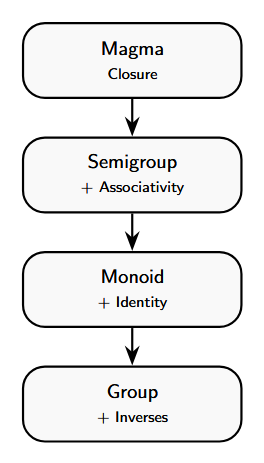
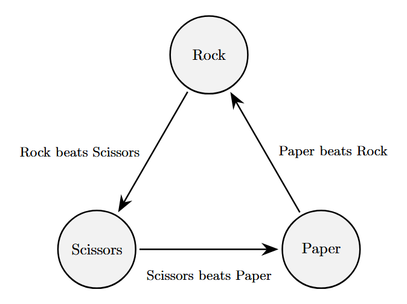

## Introduction

Normally, groups in this class require four things in order to be classified as a group: closure, associativity, an identity, and an inverse. Rings and fields require a little bit more, but magmas require the bare minimum.

It is interesting that we keep expanding on the idea of a group, but we have not really explored the bare minimum. By removing most of the requirements of a group and leaving closure, we get a structure called a magma. From magmas we can add associativity to get semigroups. From semigroups if we add the existence of an identity element we get monoids, which then leaves adding in the property of inverses in order to finally get to groups.

<figure>
  
</figure>

# Magma

## Definition

A magma is a set $M$ that has a single binary operation $*$ that satisfies only one rule: closure. This means that for any two elements $a, b \\in M$, the result $a * b$ must also be in $M$.

## Why Does This Matter

Magmas give a baseline from which every other algebraic structure is built by adding additional rules. They help define stronger structures clearly because they show that algebra starts with just an operation and not as a structure, which makes them the beginning of all algebraic structures.

## Examples

### Rock, Paper, Scissors

<figure>
  
</figure>

Consider the set $\\{R, P, S\\}$, where $a * b$ is defined as the winner of the match, where

$$
\\begin{aligned}
R * P &= P \\\\
R * S &= R \\\\
S * P &= S
\\end{aligned}
$$

This set is closed because any match between elements of $\\{R, P, S\\}$ results in an element still in the set.

This operation fails associativity from the image provided because

$$
(R * P) * S = P * S = S,
$$

but

$$
R * (P * S) = R * S = R.
$$

There is no identity element that leaves rock, paper, or scissors unchanged. There are also no inverses, since inverses require the existence of an identity element.

### Other Examples

Some other examples of magmas are the integers under subtraction, non zero integers under division, the integers under exponentiation, and other non associative structures.

# Semigroups

## Definition

Next on the hierarchy after magmas is semigroups.  A semigroup is just a magma with the added rule of requiring associativity. Now, for any $a,b \\in M$ we also need

$$
(a * b) * c = a * (b * c).
$$

So semigroups have the properties of closure and associativty, but no identity element nor inverses.

## Why Does This Matter

Every structure from a semigroup and onwards on the hierarchy of algebraic structures will now satisfy associativity. This is useful because associativity is a foundational rule in algebra that lets us actually do algebra. It allows us to factor things because we do not have to think of different parantheses acting differently on simialr operations.

## Example

An example of a semigroup is the natural numbers (not including zero) under addition, $(\\mathbb{N},+)$. Let $a,b \\in \\mathbb{N}$. There is closure because $a + b \\in \\mathbb{N}$ and there is associativity because

$$
(a + b) + c = a + (b + c).
$$

Notice that there is no inverse because the inverse of $a$ would need to be $-a$ which does not exists in the bound of natural numbers. Thus, the natural numbers (not including zero) under addition is a semigroup. I will talk about what happens if we include zero later.

# Monoids

## Definition

Adding on to the rules of a semigroup we can get to monoids. A monoid is a semigroup that has an identity element where there exists some $e \\in M$ such that for any $a \\in M$,

$$
e * a = a * e = a.
$$

So a monoid has the properties of closure, associativity, and an identity element, but no inverses.

## Why Does This Matter

When looking at a monoid it can help identify what role the idenity element starts to play in group theory. It can also help show why inverses, when defining a group, create a stronger condition. They can be important in computer programming because having an identity element can serve as having a neutral starting point that does not change anything when combining two things, for example concatenation or combining data sets.

## Example
The natural numbers including 0, under addition turns the semigroup into a monoid.  The inclusion of zero brings an identity element because,

$$
0 + a = a + 0 = a
$$

for any $a \\in \\mathbb{N}$.

## Free Monoids
The most simple monoid is known as the free monoid. This starts with a set of generators, like letters, and consists of all possible strings that can be made with them. It also contains an empty string in order to have an identity element. This is common when the binary operation is concatenation. It is known as free because, for example, if there are generators $a$ and $b$, the sequence $ab$ is not the same as the sequence $ba$.

### Example

Let $A$ be the set of letters $\\{a,b,c\\}\$. Let $S$ be the set of all finite strings formed from A, including the empty string $e$. Let $\*$ being the binary operation of concatenation. This has the property of closure because for any two strings $x,y \\in S$, the concatenation of $x\*y$ is a new finite string that is in $S$.

This has associativity  because, for any $x,y,x \\in S$

$$
(x * y) * z = x * (y * z) = xyz.
$$

The identity also exists because of the inclusion of the empty string because, for any $x \\in S$,

$$
x * e = x * e = x.
$$

# Groups

Now we finally get to groups. A group is just a monoid with the added property of having an inverse. Inverses are important for groups because they ensure that the operations performed within a group are reversible. This is where symmetries start to appear. This is also important for cancelling because if we have $ab = ac$, we can multiply both sides by $a^{-1}$ in order to get that $b = c$, which is a fundamental rule for manipulating algebra that cannot always hold true in all of the previous structures. Inverses also ensure that information is preserved since every step can be reversed, there is always a mapping from one state to another forming a bijection. Also, in a group, every element has only one unique inverse, which helps when forming proofs and applications.

# Conclusion

The progression of the hierarchy from magmas to groups shows that algebra is built step by step by adding more and more structure. Each new property of closure, associativity, identity, and inverses solve different limitations that the previous structure was lacking. This can make groups seem like more of a natural process, instead of something that is complicated.
